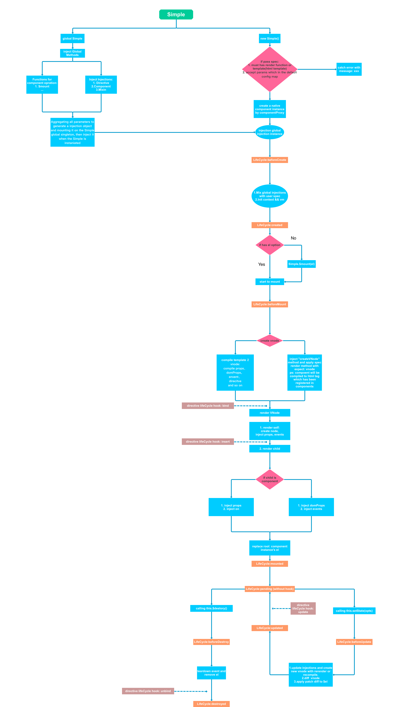
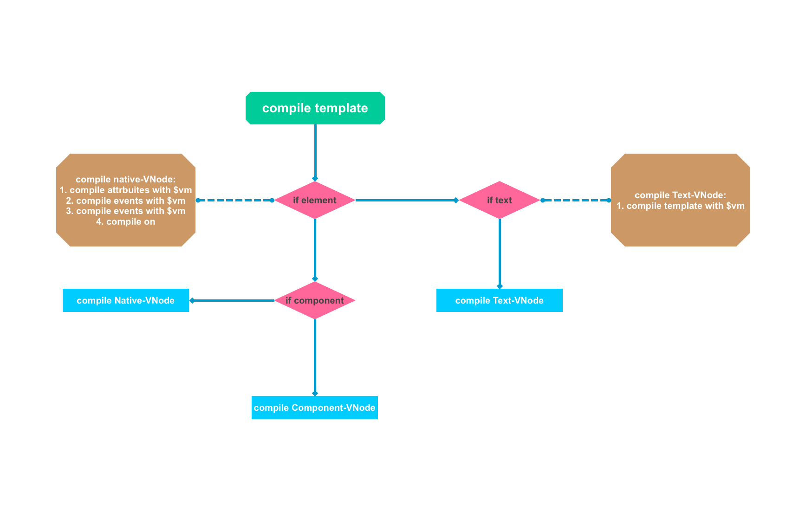

# Simple.js
Simple to run, Simple to use, Simple to thought, Simplify MVVM js framework 

# Flow


# Compile

# Global

* init self methods (mount / inject...)
* init components / mixins / directives
* inject into per native component

# Component LifeCycle FLow

* inject global injections 
* inject self injections && init events hub  
* **LifeCycle: beforeCreate** (Suggest to do some global options without relationship to component)
* init reactivities self and global state / methods / components  
* **LifeCycle: created** (Suggest to do some data or event initialize)
* start to mount 1: (autoBind if with el option or by **Simple.mount(el, component)**) 
* start to mount 2: mountChild && inject props 
* render1: (compile template to vnode: **compile event, components, props, directive...**, create $el)
* render2: render vnode
* **LifeCycle: beforeMount** (with all component options but $el)
* create el mount to container && counter component id
* **LifeCycle: mounted** (can do all)
* on state / prop change 
* **LifeCycle: beforeUpdate** (can do all)
* rerender component with diff, create root el by apply patch, update children components. old component will emit destroy if component replaced 
* **LifeCycle: updated** (can do all)
* on destroy calling
* **LifeCycle: beforeDestroy** (can use component options in the last time)
* teardown injects / set lifeCycle 'destroyed' / pass data relationship / remove events from hub
* **LifeCycle: destroyed** (suggest to clear global setter)

# Plan

1. events hub just like

```javascript
// register event
this.$on('fucker', cb)

// fire event
this.$emit('fucker', ...params)
```

2. integrate all changes and update once in next tick
