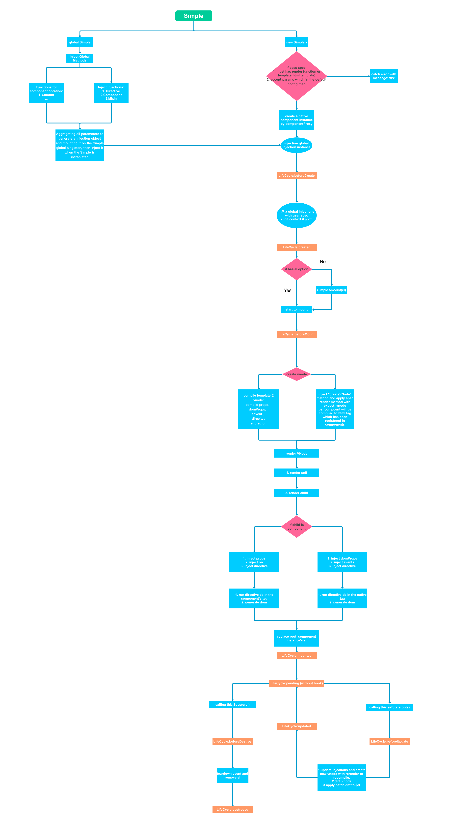

# Simple.js
Simple to run, Simple to use, Simple to thought, Simplify MVVM js framework 

# Flow

# Global

* init self methods (mount / inject...) done
* init components / mixins done (todo: directives)
* inject into per native component done

# component init

* inject global injections / components && mixins => **done**
* inject self injections / component && mixins => **done**
* **LifeCycle: beforeCreate** (Suggest to do some global options without relationship to component)
* inject component creator hash && init reactivities self and global state / methods / comoponents **done**
* **LifeCycle: created** (Suggest to do some data or event initialize)
* start to mount 1: (autoBind if with el option or by **Simple.mount(el, component)**) **done**
* start to mount 2: mountChild && inject props **mount done, inject todo**
* start to mount 3: init $children in parent, init $parent in child **done**
* render1: (compile dom to vnode: **compile event, components, props, directive...**, create $el) or create vnode directly
* compile props
* compile events
* compile directive
* render2: render vnode **done**
* **LifeCycle: beforeMount** (with all component options but $el)
* create el mount to container && counter component id**done**
* bind event
* **LifeCycle: mounted** (can do all)
* on state / prop change **done**
* **LifeCycle: beforeUpdate** (can do all)
* rerender component with diff, create root el by apply patch, update children components **done**
* if component replaced, old component emit destroyed **done**
* **LifeCycle: updated** (can do all)
* on destroy calling (autoDestroy todo??, done)
* **LifeCycle: beforeDestroy** (can use component options in the last time)
* teardown injects / set lifeCycle 'destroyed' **todo**
* teardown injects
* teardown pass data relationship
* teardown events listener
* **LifeCycle: destroyed** (suggest to clear global setter)

# TODO
**flow chart**
1. lifeCycle hook test (done half)
2. mount method bug(append to child after mounted lifecycle which cause can`t find $el in mounted lifecycle hook) done
3. directive (bind to el done, todo: bind to component auto reflow to component.$el's root) and lifecycle hooks

* bind
* update
* unbind

4. rebuild vnode component relationship
5. add compile for converting html-template to vnode